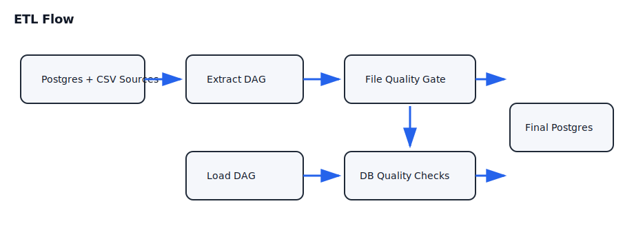

# Data Engineering Pipeline

[](https://github.com/njoppi2/data-pipeline/actions/workflows/ci.yml)
[](LICENSE)
[](https://github.com/njoppi2/data-pipeline/commits/main)

Production-style ETL pipeline that extracts from Postgres and CSV sources, stores dated artifacts, loads curated tables into a final Postgres database, and materializes analysis-ready outputs.

## Snapshot



## Problem

Make ingestion and load steps reproducible, rerunnable by execution date, and safe through explicit quality gates before loading final tables.

## Tech Stack

- Apache Airflow
- PostgreSQL
- Docker / Docker Compose
- Python (Pandas, SQLAlchemy, Psycopg2)

## Repository Layout

- `dags/data_engineering_pipeline.py`: DAG definitions and ETL logic
- `data/`: source SQL/CSV and generated output folders
- `docker-compose.yml`: local platform (Airflow + Postgres + Redis)
- `main.ipynb`: notebook execution and inspection
- `utils/health_check.py`: database container health check

## Quickstart

1. Create env files:

```bash
cp .env.example .env
cp dags/.env.example dags/.env
```

2. Start services:

```bash
make start
```

3. Open Airflow at `http://localhost:8080` (`airflow` / `airflow`).

4. Trigger DAGs in order:
- `data_extraction_and_local_storage`
- `data_loading_to_final_database`

Stop services:

```bash
make stop
```

## Validation and CI

Local checks:

```bash
python -m compileall dags utils
docker compose -f docker-compose.yml config > /dev/null
python utils/validate_data_contracts.py \
  --contract contracts/order_details.contract.json \
  --csv data/order_details.csv
```

CI (`.github/workflows/ci.yml`) validates:

- Python syntax for DAG/util modules
- Docker Compose configuration with env templates
- Required environment template files
- Fixture data validation against contract rules

## Results

- Two-step DAG flow is date-parameterized and rerunnable.
- Extraction output is validated before final DB load.
- Load DAG runs table-level quality checks before finishing.

## Limitations

- Notebook-first exploration remains part of the workflow.
- Data quality rules are still minimal and table-specific.
- No performance benchmarking for larger source volumes yet.

## Roadmap

- Expand data contracts (schema/value constraints per table).
- Add fixture-based integration tests for ETL paths.
- Publish a sample dashboard/queries over the final dataset.

## Data Contracts

- Contract definitions live in `contracts/`.
- Current contract coverage includes `order_details` via `contracts/order_details.contract.json`.
- Detailed notes: [docs/data-contracts.md](docs/data-contracts.md).

## Contributing

See [CONTRIBUTING.md](CONTRIBUTING.md).
